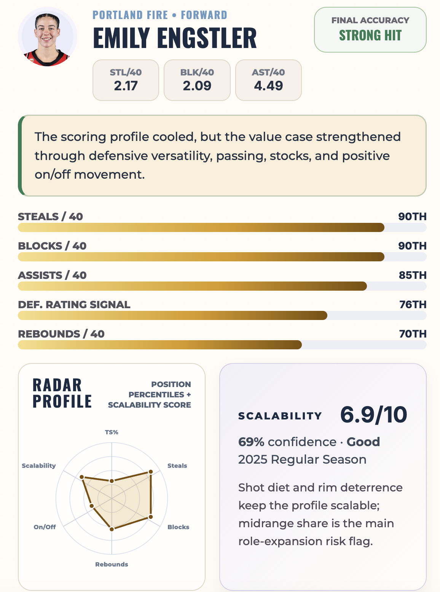

# WNBA Undervalued Contract Retrospective

**A decision-support notebook reassessing five originally undervalued WNBA contracts through 2023-2025 production, 2026 salary context, and scalability signals.**

This project revisits a five-player undervalued contract cohort to test which cases still hold up once the original hidden-value lens is reframed against 2026 salary levels, comparable-player context, and role-scalability evidence. The repo is intentionally slim: the notebook is the main public deliverable, and the supporting CSVs act as evidence tables rather than a full reproducibility dump.

## Preview

<p align="center">
  
</p>


## Live Project

- HTML Notebook: https://kbsmd-sportsmusicdata.github.io/hidden-value-contract-analysis/
- GitHub Repo: https://github.com/kbsmd-sportsmusicdata/hidden-value-contract-analysis


## Why This Project Matters

The original undervalued-contract case was useful as a snapshot, but front offices need to know which value signals survive once the market catches up. This retrospective separates players who still look underpriced from players whose salaries have corrected, using current comp context, on-court impact, and scalability evidence in one decision-support frame.

## Key Questions

- Which originally flagged undervalued players still grade as salary surplus in the 2026 market?
- Which players show scalable hidden value even when market pricing has corrected?
- Which cases now read as fair market, corrected, or higher-risk bets?

## Audience

- WNBA front office decision-makers
- Salary cap and roster strategy staff
- Sports analytics portfolio reviewers

## Project Outputs

- Primary deliverable: `notebooks/index.html`
- Executive summary: `docs/executive_summary.md`
- Methodology: `docs/methodology.md`
- Data dictionary: `docs/data_dictionary.md`
- Validation output: `reports/validation_summary.md`

## Supporting Evidence Tables

- `data/processed/top5_undervalued_panel.csv`: Five-player retrospective panel with value, trend, and scalability fields.
- `data/processed/wnba_2026_contract_status.csv`: Contract-year status and roster-control context.
- `data/processed/wnba_2024_2026_salary_bridge.csv`: Salary bridge linking recent performance context to 2026 contract framing.
- `data/processed/wnba_2026_team_cap_table.csv`: Team-level cap structure context.

## Headline Findings

- Leonie Fiebich remains the clearest retained surplus case in the refreshed group, pairing elite efficiency with a salary that still sits below the modeled expectation and comparable-player frame.
- Naz Hillmon and Jordan Horston still show strong hidden-value and scalability signals, but their 2026 salary context reads closer to market-corrected than clear bargain territory.
- Emily Engstler and Nyara Sabally remain useful cases, but the refreshed evidence pushes them toward more mixed or risk-adjusted interpretations than the original undervalued framing suggested.

## Methodology Summary

The retrospective uses a rules-based framework rather than a predictive model. It combines salary discount, comparable-player pricing, true shooting efficiency, on/off impact, hidden-value tags, and a source-backed scalability rubric. When the preferred season snapshot is unavailable, evidence precedence falls back in this order: same-season regular season, same-season playoffs, prior-season regular season, prior-season playoffs.

## Validation Summary

Validation checks file presence, CSV row and column counts, duplicate rows, and missing-value patterns for the four shipped evidence tables. See `reports/validation_summary.md` for the latest generated output.

## Repo Structure

```text
/data
/docs
/notebooks
/reports
/scripts
/sql
/templates
```

## How To Run

```bash
pip install -r requirements.txt
python scripts/init_project.py
python scripts/validate_data.py
python scripts/publish_check.py
```

## Future Extensions

- Add individual one-page player briefs for each contract case
- Expand the cohort beyond the original class assignment of five players
- Add a lightweight comparison table for salary tier, production tier, and scalability tier
- Add 2026 stats; update at midseason and again at end of season
